# Python MongoDB Project

This project uses Python to extract Star Wars starship data from the [SWAPI Starships API](https://swapi.dev/api/starships/), transform pilot references into MongoDB ObjectIDs, and load the transformed data into MongoDB.

## Project Objectives

- Extract all available starship data from the SWAPI API.
- Replace each pilot URL with the corresponding MongoDB ObjectID from the `characters` collection.
- Insert the transformed starship data into a separate `starships` collection.
- Use Python functions to organise the ETL process.

## Technologies Used

- Python
- MongoDB
- PyMongo
- SWAPI API
- Requests library

## MongoDB Setup

Before running the ETL process, MongoDB was installed locally and MongoDB Compass was used to create the `starwars` database and the `characters` collection.

The `characters` collection was populated separately and is used in this project to match pilot URLs from SWAPI with the corresponding MongoDB ObjectIDs.

For the MongoDB setup and `characters` collection creation, see:

`MongoDB Setup - documentation to be added`

### Starting Database State

The `starwars` database initially contains only the `characters` collection.

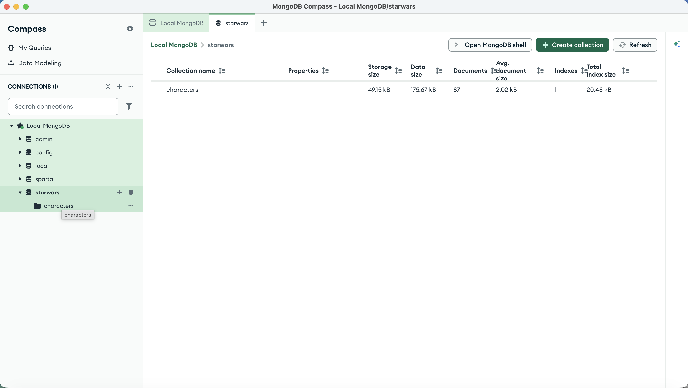

### Python Dependencies

The project uses the following Python packages:

- `requests` - retrieves data from the SWAPI API
- `pymongo` - connects Python to MongoDB

These dependencies are listed in `requirements.txt` and imported at the start of the Python script:

```python
import requests
from pymongo import MongoClient
```

### Connect to MongoDB

Python connects to the local MongoDB server using `MongoClient`, selects the `starwars` database, and accesses the existing `characters` collection.

```python
client = MongoClient("mongodb://localhost:27017/")
db = client["starwars"]
characters_collection = db["characters"]
```
### Retrieve Starship Data from SWAPI

A GET request is sent to the SWAPI starships endpoint using the `requests` library. The JSON response is then parsed into a Python dictionary.

```python
response = requests.get("https://swapi.dev/api/starships/")
data = response.json()
```

The HTTP status code is checked to confirm that the API request was successful. A status code of `200` indicates that the request completed successfully.

```python
print(f"API response status code: {response.status_code}")
```

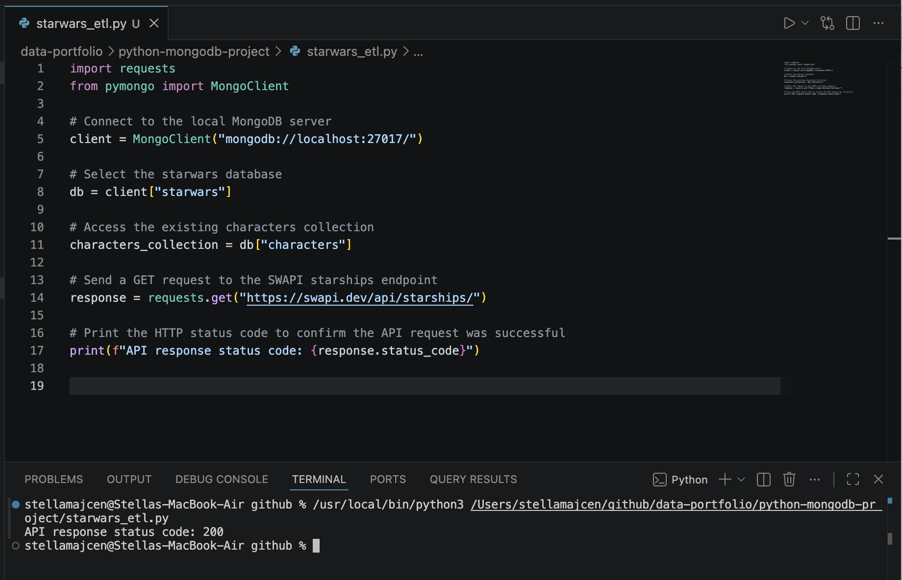

The API response contains information about the available starships, including:

- `count` - total number of starships
- `next` - URL for the next page of results
- `previous` - URL for the previous page
- `results` - list of starship dictionaries returned on the current page

The response is converted into a Python dictionary using `response.json()`.

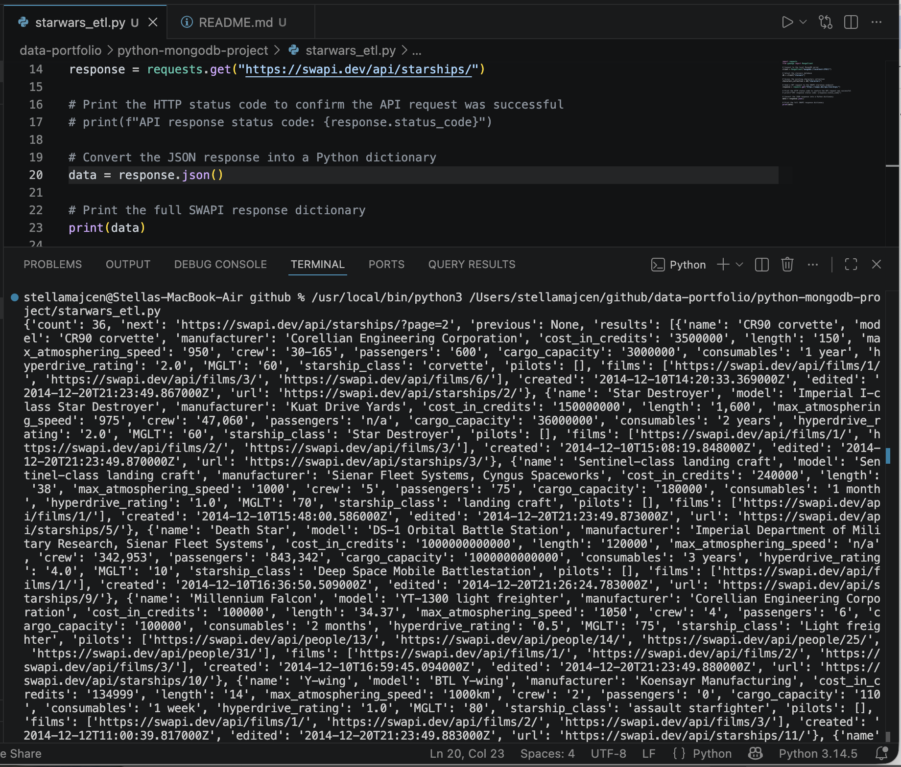

The API response includes a `next` URL, showing that additional pages of starship data are available. The first API page contains 10 starship records in the `results` list.

```python
print(len(data["results"]))
```

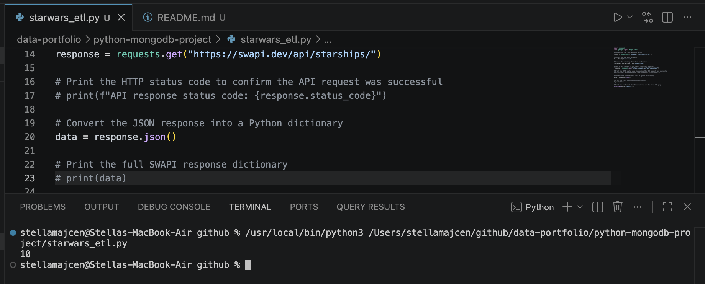

### Retrieve All Starships

Because the SWAPI response is paginated, a function is used to loop through each page until no `next` URL remains. The starships from each page are added to a single list.

```python
def get_all_starships():
    url = "https://swapi.dev/api/starships/"
    all_starships = []

    while url:
        response = requests.get(url)
        data = response.json()

        all_starships.extend(data["results"])
        url = data["next"]

    return all_starships

starships = get_all_starships()
```

The function retrieves all 36 available starships.

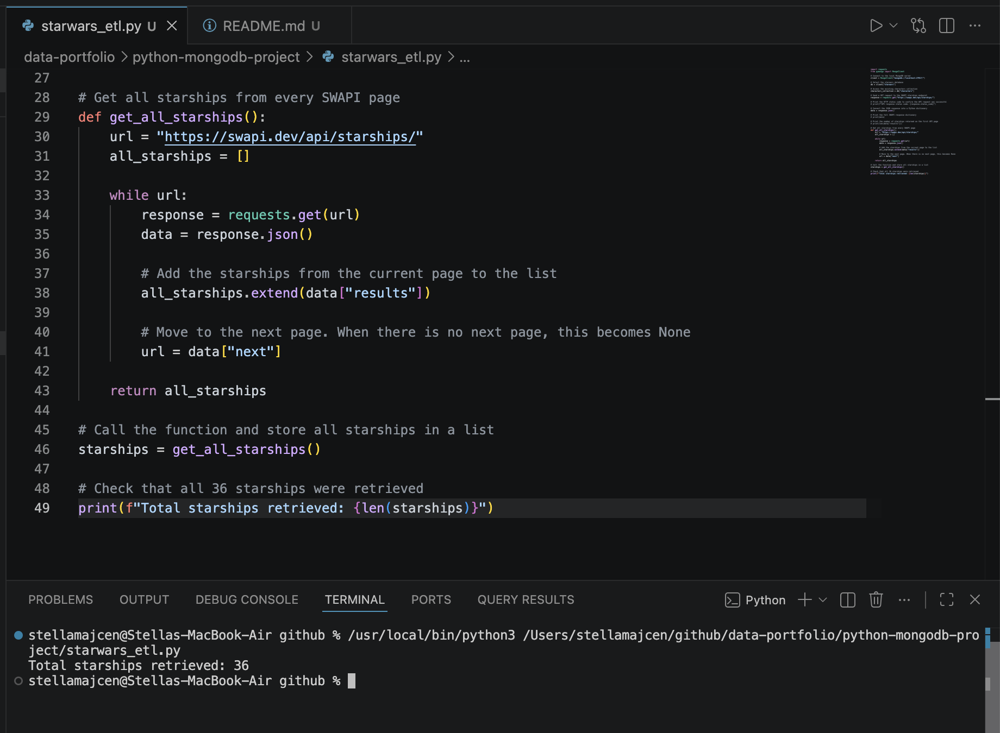

### Test Pilot Lookup by SWAPI URL

The pilot URL from the starship data is first tested directly against the `characters` collection.

```python
pilot_url = "https://swapi.dev/api/people/13/"
pilot = characters_collection.find_one({"url": pilot_url})
print(pilot)
```

The lookup returns `None`, confirming that the `characters` collection does not contain a matching pilot SWAPI `url` field.

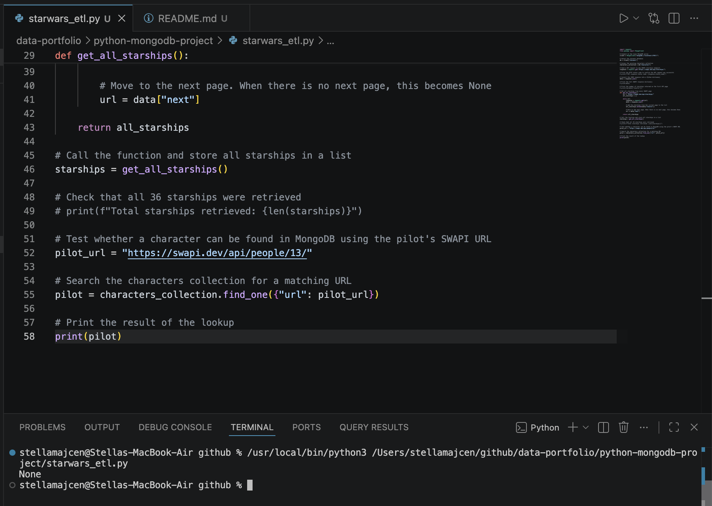

### Test Pilot Lookup by Character Name

Because the `characters` collection does not contain the pilot SWAPI URL, the next test searches for a character by name instead.

```python
pilot = characters_collection.find_one({"name": "Chewbacca"})
print(pilot)
```

The lookup successfully returns the matching character document from MongoDB, including its `_id`.

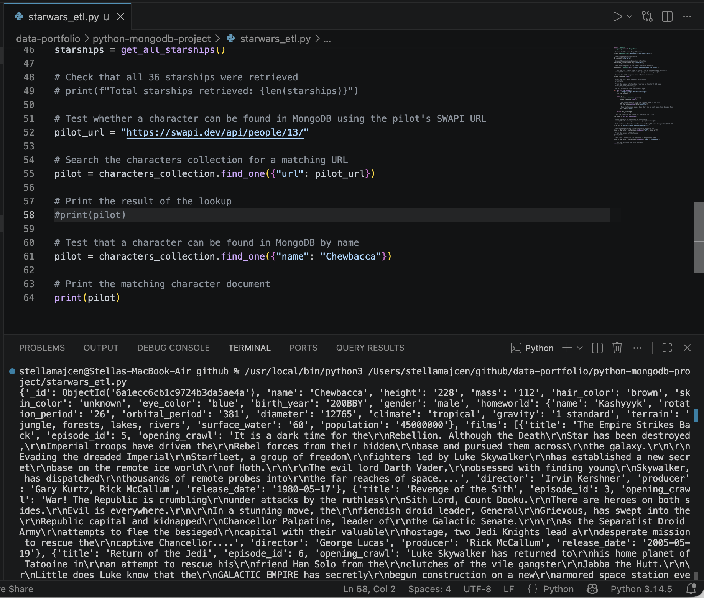

### Convert Pilot URL to MongoDB ObjectId

A function retrieves the pilot data from the SWAPI URL, extracts the pilot name, finds the matching character in the `characters` collection, and returns that character's MongoDB `_id`.

```python
def get_pilot_object_id(pilot_url):
    pilot_response = requests.get(pilot_url)
    pilot_data = pilot_response.json()

    pilot_name = pilot_data["name"]

    pilot = characters_collection.find_one({"name": pilot_name})

    return pilot["_id"]
```

The test confirms that a pilot SWAPI URL can be converted to the matching MongoDB ObjectId.

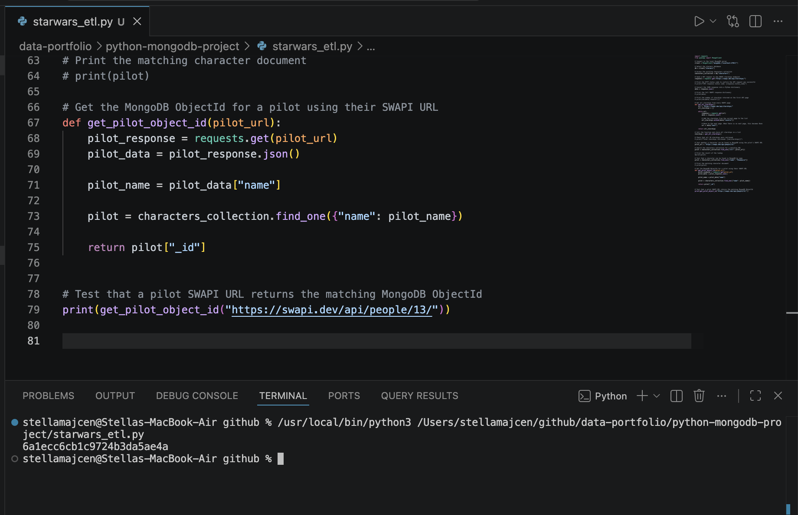

### Replace Pilot URLs with MongoDB ObjectIds

A function loops through each starship and replaces every pilot SWAPI URL with the corresponding MongoDB ObjectId.

```python
def replace_pilot_urls(starships):
    for starship in starships:
        pilot_object_ids = []

        for pilot_url in starship["pilots"]:
            pilot_object_ids.append(get_pilot_object_id(pilot_url))

        starship["pilots"] = pilot_object_ids

    return starships

starships = replace_pilot_urls(starships)
```

The test confirms that the pilot URLs have been replaced with MongoDB ObjectIds.

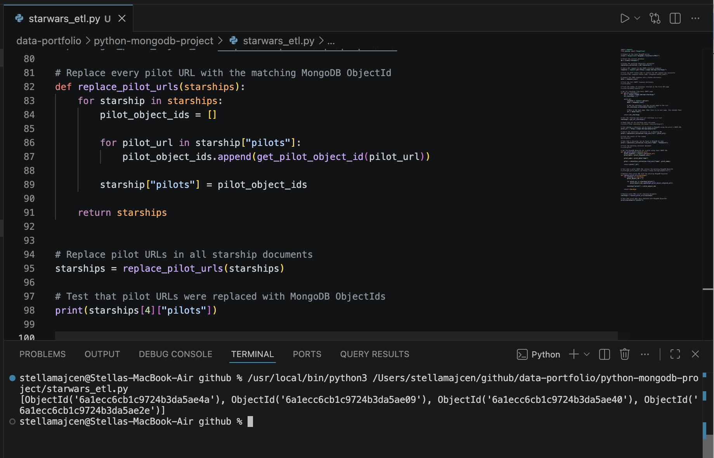

### Load Starships into MongoDB

The transformed starship documents are inserted into the `starships` collection in the `starwars` database.

```python
starships_collection = db["starships"]

starships_collection.delete_many({})

result = starships_collection.insert_many(starships)

print(f"Starships inserted: {len(result.inserted_ids)}")
```

The output confirms that all 36 transformed starship documents were inserted successfully.

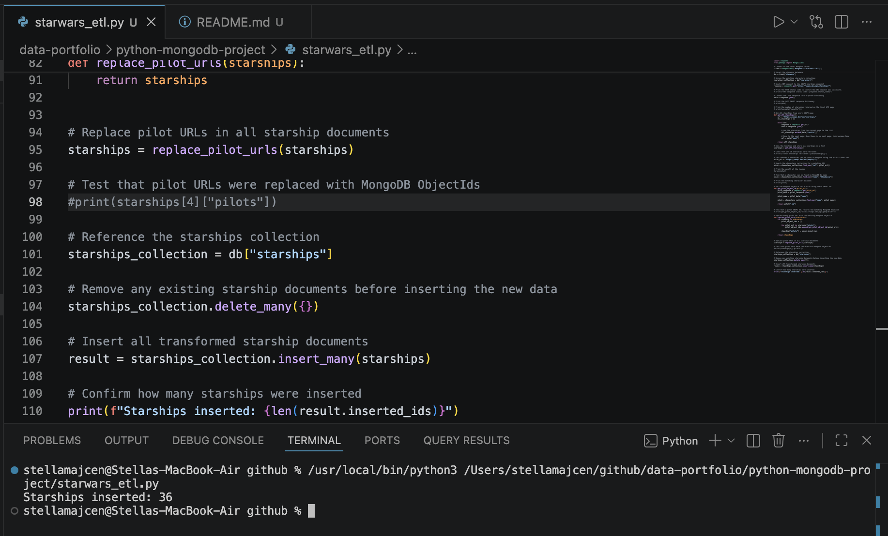

## Final Result

The ETL process successfully created and populated the `starships` collection in the `starwars` database.

The final database contains:

- `characters` collection - 87 documents
- `starships` collection - 36 documents

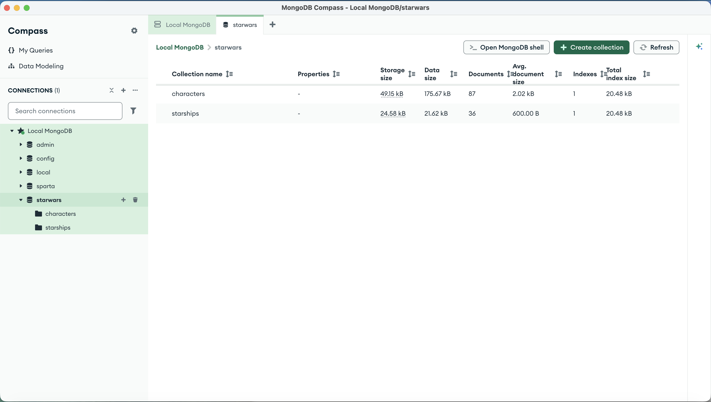

The `starships` collection contains the transformed starship documents. Pilot URLs have been replaced with MongoDB ObjectIds where pilots are known.

Some starships do not have pilots, so their `pilots` array is empty.

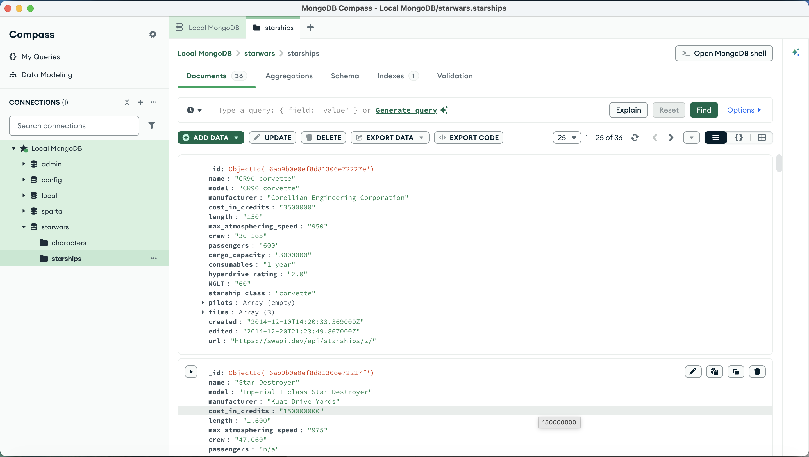

